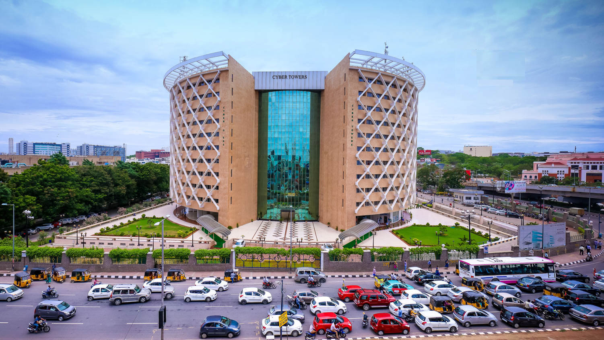

# assignment2-Bandharapu
Creating repo for assignment 2
Git hub is useful in many ways
The more we use it, the we undertand it
# Manish Goud Bandharapu
###### Lbnagar 
**Lbnagar** is located in hyderabad india it is known as area of flyovers **i like it because i born here and i currently live here**  it is the best place one can easily adopt to live with the people. 

*** 

### Direction from maryville to my favourite location
1. From maryville to kansas city
    1. Kansas city to airport
1. Kansas airport to doha airport
1. Doha airport to hyderabad 
1. Hyderabad airport to lbnagar
    1. By cab or public transport

* Sweets
* Soft drinks
* Spicy indian snacks 
* Ice creams 
* Water bottles
* Sports equipments
* Camera for capturing the beautiful locations

***

[]

***

### Representing a table for food/drinks

We are preparing a table that shows the four food items and drinks which everyone should try that are going to be available at many locations.
| Items | Location | Cost |
| :---: | :---: | :---: |
| Cookies | Q Bakers | 150 |
| Samosa | More store | 90 |
| Sugarcane drink | Food on wheels | 80 |
| Faluda drink | Lassi shop | 75 |

***

### Pithy Quotes
> To accomplish great things, we must not only act, but also dream; not only plan, but also believe - *Anatole france*

> Without ambition one starts nothing, without work one finishes nothing. The prize will not be sent to you, you have to win it - *Ralph waldo emerson*

***

***

### Code Fencing

> A spanning tree is a subset of Graph G, which has all the vertices covered with minimum possible number of edges. Hence, a spanning tree does not have cycles and it cannot be disconnected.

[graph spanning](https://www.tutorialspoint.com/data_structures_algorithms/spanning_tree.htm)

  int n;  
  vector<vector<int>> adj; // adjacency matrix of graph  
  const int INF = 1000000000; // weight INF means there is no edge  
  struct Edge {  
  int w = INF, to = -1;  
  };  
  void prim() {  
  int total_weight = 0;  
  vector<bool> selected(n, false);  
  vector<Edge> min_e(n);  
  min_e[0].w = 0;  
  for (int i=0; i<n; ++i) {  
  int v = -1;  
  for (int j = 0; j < n; ++j) {  
  if (!selected[j] && (v == -1 || min_e[j].w < min_e[v].w))  
  v = j;  
  }  
  if (min_e[v].w == INF) {  
  cout << "No MST!" << endl;  
  exit(0);  
  }  
  selected[v] = true;  
  total_weight += min_e[v].w;  
  if (min_e[v].to != -1)  
  cout << v << " " << min_e[v].to << endl;  
  for (int to = 0; to < n; ++to) {  
  if (adj[v][to] < min_e[to].w)  
  min_e[to] = {adj[v][to], v};  
  }  
  }  
  cout << total_weight << endl;  
  }  

  [code source](https://cp-algorithms.com/graph/mst_prim.html)

  ***